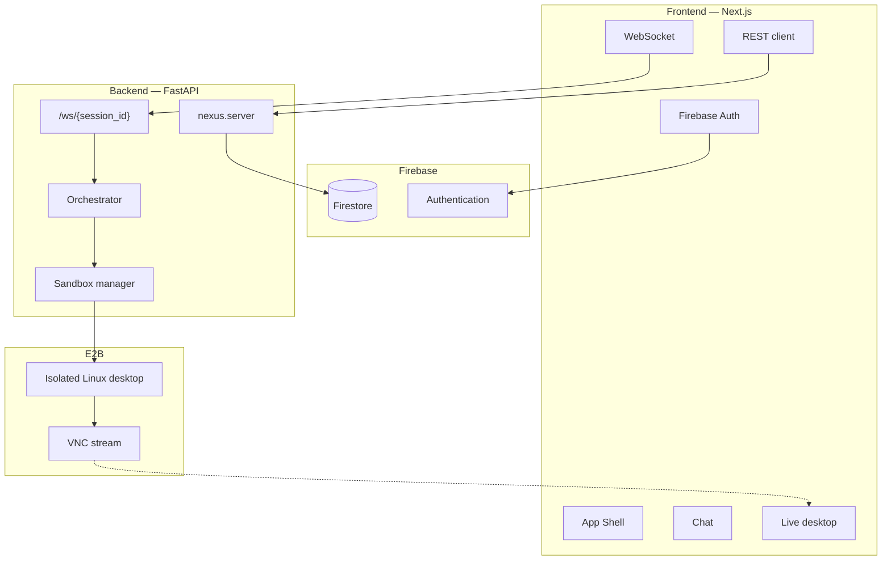
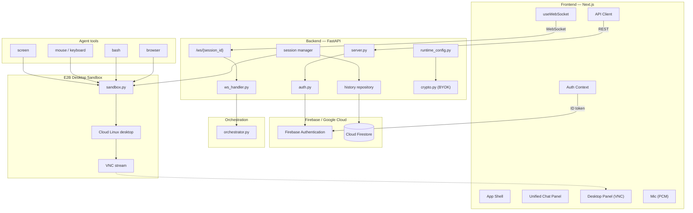
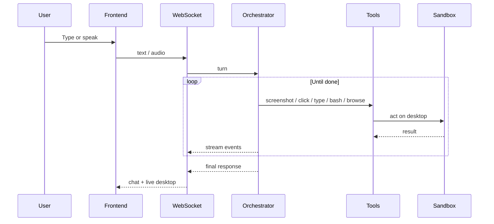
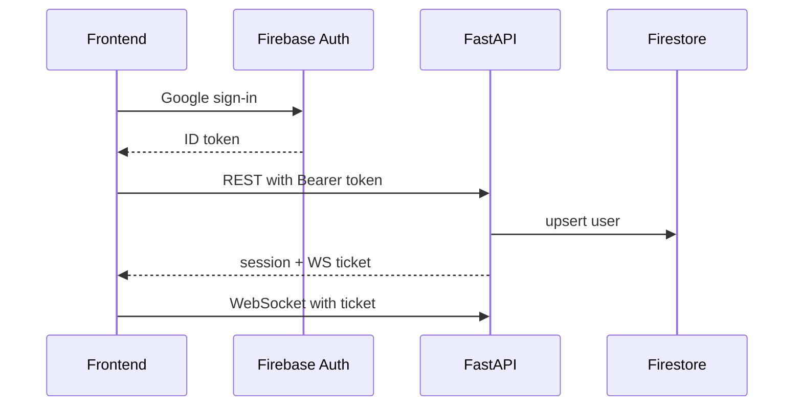
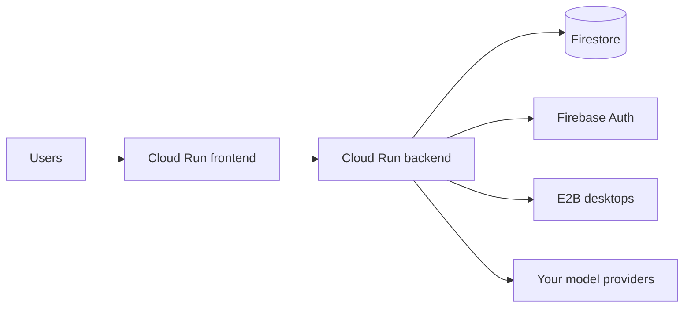

# CoComputer

Give an agent a real computer.

You talk. It actually does the work — on a real screen, not in a chat bubble.

Each session boots an isolated cloud Linux desktop. Chat sits next to a live desktop. The agent can see the screen, click, type, run the terminal, browse, and use the tools you connect.

Add your own API keys in Settings before using the agent (BYOK).

## What it does

- Isolated Linux desktop per session (E2B sandbox)
- Live screen in the workspace — the agent sees what is on it
- Mouse, keyboard, and terminal — not text-only
- Talk or type in the same session
- Connectors you opt in: Drive, Gmail, GitHub, Linear, Slack, Vercel, MCP, and more
- Your models, your keys — encrypted BYOK, no single-vendor lock-in
- Session history, artifacts, and templates

## Stack

- **Frontend:** Next.js, TypeScript, Tailwind CSS
- **Backend:** FastAPI (Python)
- **Auth & data:** Firebase Auth, Firestore
- **Desktop:** E2B cloud Linux sandboxes (live VNC)
- **Models:** BYOK — Gemini, OpenAI, Anthropic, Qwen, OpenRouter, and custom providers
- **Deploy:** Google Cloud Run

## Local setup

### Prerequisites

- Node.js 20+
- Python 3.11+
- Firebase project (Auth + Firestore)
- [E2B](https://e2b.dev) API key
- At least one model provider key (configured in the app Settings after sign-in)

### Backend

```bash
cd agent
python -m venv .venv
source .venv/bin/activate  # Windows: .venv\Scripts\activate
pip install -e .
cp .env.example .env       # fill E2B, Firebase, and encryption keys
uvicorn nexus.server:app --reload
```

### Frontend

```bash
cd frontend
npm install
cp .env.example .env.local  # AGENT_URL, WebSocket URL, Firebase web config
npm run dev
```

Open [http://localhost:3000](http://localhost:3000), sign in with Google, add keys in Settings, start a session.

## Try it

1. **Desktop** — “Open a browser and search for today’s AI news.” Watch the live screen.
2. **Terminal** — “Create a folder `demo` and a `hello.py` that prints hello, then run it.”
3. **Voice (optional)** — Mic on, “What do you see on the screen right now?”
4. **Connectors** — Connect GitHub or Drive, then ask the agent to use them.

## Architecture

<details>
<summary>System overview</summary>



</details>

<details>
<summary>Full architecture diagrams</summary>

### System Overview



### Session loop



### Auth



### Deploy



</details>

## Demo

[4-minute walkthrough](https://www.youtube.com/watch?v=9g9S6vdoNbA) — browse, terminal, and working on a real desktop.
